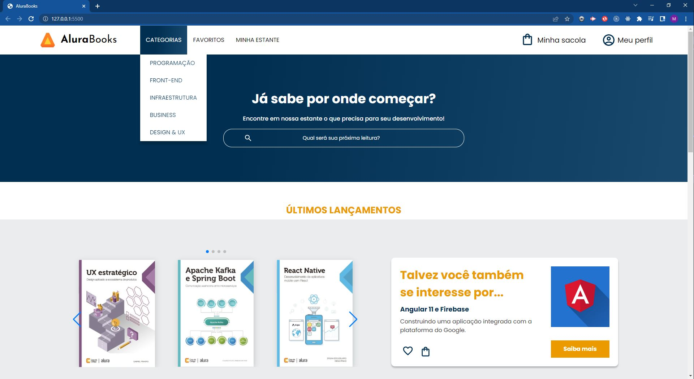

# AluraBooks - curso de responsividade

Projeto feito durante o curso de responsividade, de acordo com [projeto elaborado no figma](https://www.figma.com/file/sSMbIqKaGBd66Y8roxTk2p/AluraBooks?node-id=37%3A94&t=0zcdXYnce9jxjXVX-0). 

## Table of contents

- [Overview](#overview)
  - [Screenshot](#screenshot)
  - [Links](#links)
- [My process](#my-process)
  - [Built with](#built-with)
- [Author](#author)

## Overview

### Screenshot

### Links

- Live Site URL: 

## My process

### Built with

- Semantic HTML5 markup
- CSS custom properties
- Flexbox
- CSS Grid
- Mobile-first workflow

## Author

- Frontend Mentor - [@marianaceci](https://www.frontendmentor.io/profile/marianaceci)
- LinkedIn - [Mariana Schmidt](https://www.linkedin.com/in/marianaceciliaschmidt)

